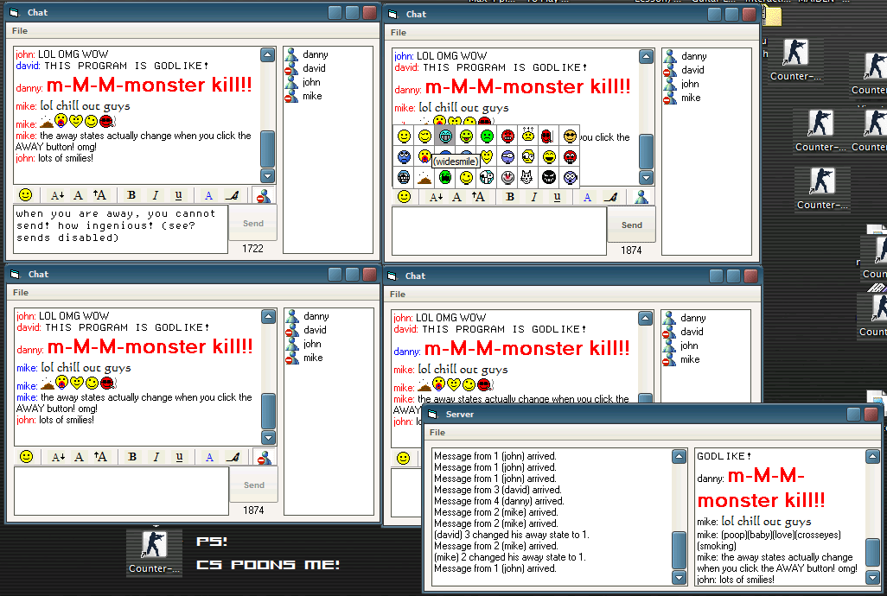



## Advanced Multiple Connection Server and Client

### Description

The coding shows for any beginner or intermediate how to solve many of the tough challenges of:

Inserting a picture without using the clipboard

.

A list of people currently in the chat room, and an icon showing whether they are away or not

.

How to use an imagelist to draw onto a picturebox that changes it's color on mouseover

.

How to use the Tree control

.

How to create your <B>VERY OWN PROTOCOL</b> using winsocks and dataarrivals

.

How to use the Toolbar control

.

How to dynamically load as many winsocks as necessary

.

How to unload spare winsocks when they are no longer in use to save memory

.

Shows how to use anti-flood methods by not allowing the client to re-post until the server sends everyone the last post

.

Shows how to use picture manipulation in a tree control

.

THERES EVEN A SPECIAL SUB HERE TO CONVERT A PICTURE TO RTF CODE!!!!!

.

You cannot send text while in an away state

.

How to create a max send, not from the text they write, but from the maximum a socket can send, ie. the TextRTF of a RichTextBox

.

How to scroll to the bottom of a textbox, where more text is added

.

Inserting smilies and converting them from pictures to strings, using their keys to store which picture they are

.

And many more techniques, including good programming habits
 
### More Info
 

             |
---                |---
**Submitted On**   |2005-02-01 20:56:22
**By**             |[DanDaMan](https://github.com/Planet-Source-Code/PSCIndex/blob/master/ByAuthor/dandaman.md)
**Level**          |Intermediate
**User Rating**    |4.9 (78 globes from 16 users)
**Compatibility**  |VB 6\.0
**Category**       |[Internet/ HTML](https://github.com/Planet-Source-Code/PSCIndex/blob/master/ByCategory/internet-html__1-34.md)
**World**          |[Visual Basic](https://github.com/Planet-Source-Code/PSCIndex/blob/master/ByWorld/visual-basic.md)
**Archive File**   |[Advanced\_M184705222005\.zip](https://github.com/Planet-Source-Code/dandaman-advanced-multiple-connection-server-and-client__1-58638/archive/master.zip)

### API Declarations

They can be viewed in the program.

